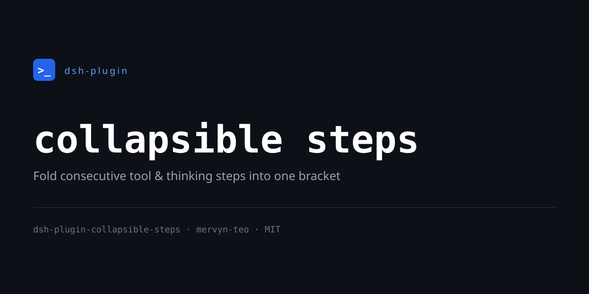

# dsh-plugin-collapsible-steps

<p align="center">
  <a href="https://github.com/mervyn-teo/dsh-plugin-collapsible-steps">
    
  </a>
</p>

English | [中文](README.zh.md)

A [DeepSeek Harness](https://github.com/deepseek-ai/deepseek-harness) (DSH) Web
plugin that folds every run of consecutive collapsible-card steps between
messages into a single `+ N steps` row. Click the row to collapse the run
(hiding all but the most recent step) or expand it back. The shipped
conversation cards and markdown answers are left untouched — the rows are
annotated, never replaced.

## What it does

- Adds a **Collapse steps / Expand steps** control to the session header, and a
  `- N steps` row before every run of consecutive step nodes.
- Collapsing a row hides that run's rows (`display: none`, so no empty gaps
  are left behind) except the most recent one, which stays below the
  `+ N steps` text; clicking `+` expands the run back.
- A "step" is any collapsible-card row — `tool-call`, `workflow-run`,
  `command`, `command-input`, `compaction`, `context` (context injection),
  `manual-compaction`, `model-retry`, and an assistant message's `Think`
  (reasoning) disclosure. The final text answer, user/steering messages, and
  turn notices act as group boundaries.
- The regular tool cards, reasoning sections, and markdown answer rendering
  all remain the shipped DSH ones.
- A **Collapsible steps** card under Settings → Plugins controls whether runs
  are collapsed by default.

## Settings

The plugin registers a `collapsible-steps` settings namespace with one option:

- `collapseByDefault` (boolean, default `true`) — collapse runs of steps by
  default. Turn it off to keep runs expanded until you collapse them manually.

## How it works

The slot system gives a plugin no way to wrap the shipped conversation cards,
so instead of replacing the step renderers this plugin annotates the shipped
DOM: it reads the conversation node order through the session hook, computes
the runs of consecutive steps, and inserts the bracket headers directly into
the existing flow (the node rows themselves are never moved, so the shipped
view keeps reconciling normally).

## Files

| File | Purpose |
| --- | --- |
| `lib/client.js` | Browser half — the header control, bracket insertion, collapse state, and the settings card. |
| `lib/index.js` | Host half — registers the `collapsible-steps` settings namespace. |
| `lib/invariant.js` | Invariant registration. |
| `cordis.patch.yml` | Composition patch that inserts the plugin row and its default config. |
| `package.json` | Package metadata (`dsh.bundle` + `dsh.client` manifest). |

## Install

```bash
dsh plugin --profile web add github:mervyn-teo/dsh-plugin-collapsible-steps
```

Then restart `dsh web` — host bundles load at boot.

## Requirements

- DSH with the base conversation UI (`@deepseek-ai/dsh-client-ui-conversation`)
  mounted — the plugin inserts brackets into its chat flow.

## License

[MIT](LICENSE)
